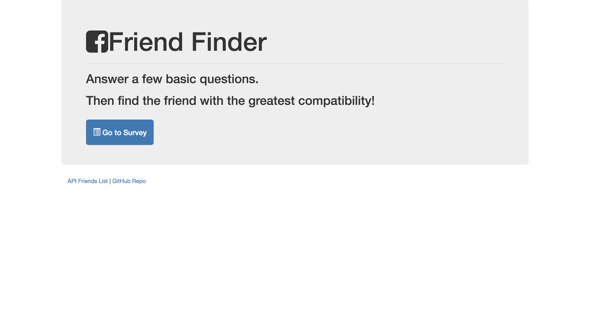
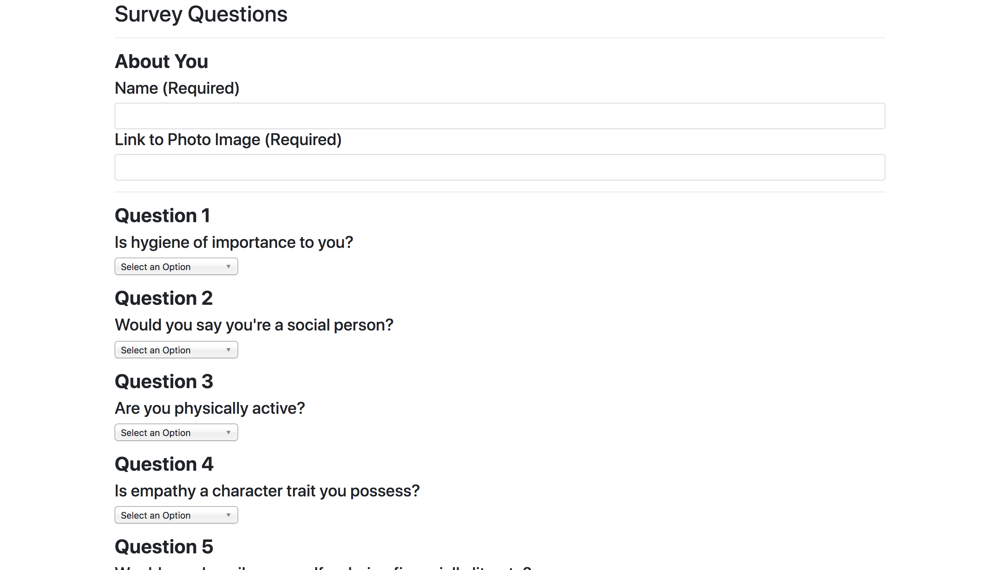
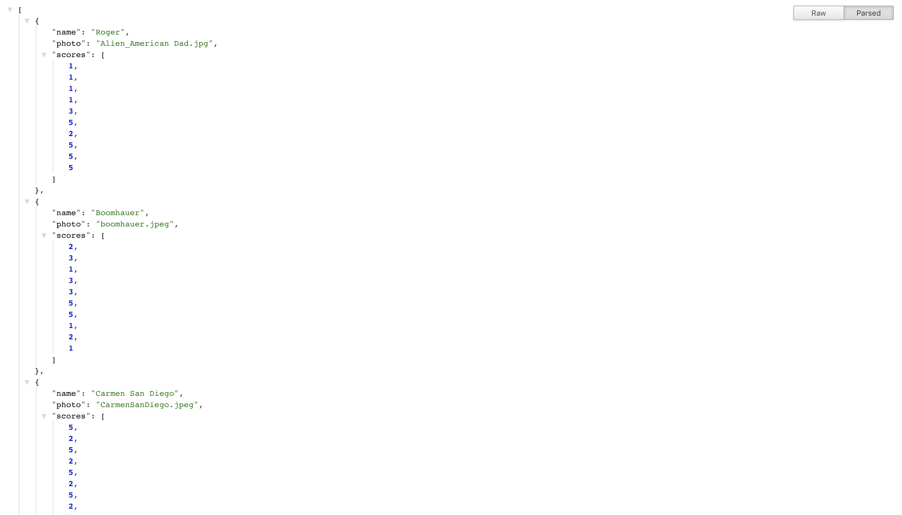

# FriendFinder

(https://hidden-anchorage-95966.herokuapp.com/)

## Description
"Friend Finder" is a compatibility-based application that takes in results from your user's survey and compares their response to those of other users. Using Node & Express, the app compares the client's survey answers and displays their best overall match.
 

## Sample View
Homepage 

Survey

Best Match

API List

## Technology

+ Node.js
+ Express.js
+ Javascript
+ Jquery
+ Bootstrap
